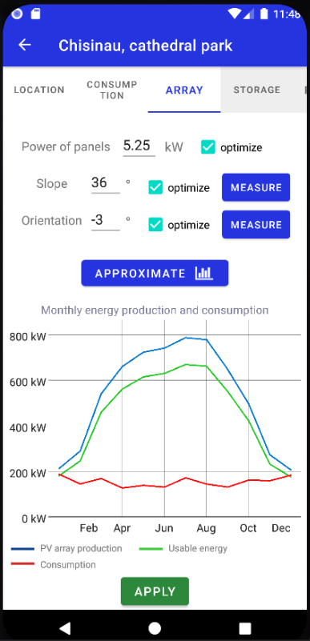

# PVPlan
Android application for estimating the power production of photovoltaic pannels. This project was done as a license thesis.

 

## Description

This application enables their users to:
1. Manage the existing plans;
2. (Make new plan and) Select the PV system location;
3. Specify the electrical consumption profile;

 

5. Configure the characteristics of PV array of panels;
6. Configure the electricity storage method and details;

 

7. Compute and display teh results (and save the project).

 

